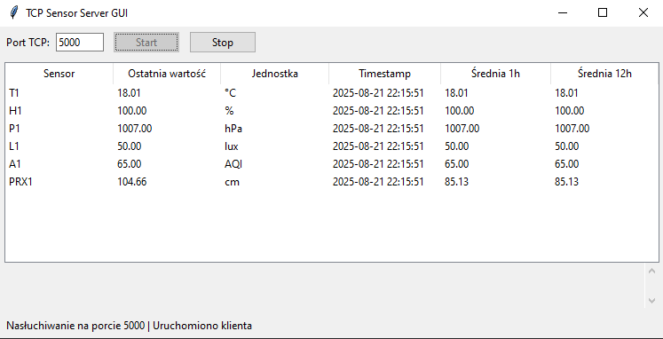

# Sensor Monitoring System

## Temat projektu

System służy do symulacji oraz monitorowania pracy wielu typów czujników: temperatury, wilgotności, ciśnienia, jakości powietrza, światła, przyspieszenia oraz zbliżeniowych. Dane generowane są w czasie rzeczywistym oraz mogą być przesyłane przez sieć, zapisywane do plików, a także prezentowane w graficznym interfejsie użytkownika.

---

### Główne funkcjonalności projektu

- **Symulacja czujników:**  
  Każdy rodzaj czujnika jest zaimplementowany jako oddzielny plik Python (np. `TemperatureSensor.py`, `PressureSensor.py`, `LightSensor.py`). Generowane są losowe, realistyczne wartości w określonych interwałach.

- **Logowanie danych:**  
  Moduł `Logger.py` odpowiada za zapisywanie odczytów do plików CSV, zarządzanie archiwami oraz odczyt wcześniejszych logów.

- **Serializacja konfiguracji:**  
  Konfiguracje czujników i aplikacji przechowywane są w plikach `config.json`, `config.yaml` oraz `server_gui_config.json`.

- **Komunikacja sieciowa:**  
  Prosty serwer (`run_server.py`), klient (`run_client.py`) oraz dodatkowe moduły w folderach `network/` i `server/` umożliwiają przesyłanie danych z czujników przez sieć.

- **GUI:**  
  Graficzny interfejs (`server_gui.py`) pozwala na uruchomienie symulacji, podgląd odczytów oraz sterowanie pracą systemu.

- **Testy i analiza:**  
  Folder `tests/` zawiera testy jednostkowe. W pliku `sensors.md` opisane są wymagania dotyczące implementacji czujników.

---

## Struktura projektu

- `main.py` – główny plik uruchamiający system
- `sensor.py` – implementacja bazowej klasy czujnika
- `Logger.py` – zapis danych
- `server_gui.py` – GUI serwera
- `run_client.py`, `run_server.py` – komunikacja sieciowa
- `config.*` – konfiguracje
- `tests/` – testy jednostkowe
- `network/`, `server/` – dodatkowe moduły sieciowe

---

## Przykład działania

Po uruchomieniu projektu (np. przez `main.py` lub `server_gui.py`) generowane są przykładowe dane czujników, zapisywane do plików oraz wyświetlane w GUI. Możliwa jest również ich transmisja przez sieć.

---

## Zalecenia dotyczące pracy z projektem

- Forkuj repozytorium i commituj postępy
- Korzystaj z modularnej struktury plików
- Testuj nowe funkcjonalności w oddzielnych gałęziach
- Dokumentuj zmiany w commitach

---

## Główne ekran aplikacji

Poniżej przykładowy wygląd interfejsu:

---

## Autor

- kacperhalaj

---
